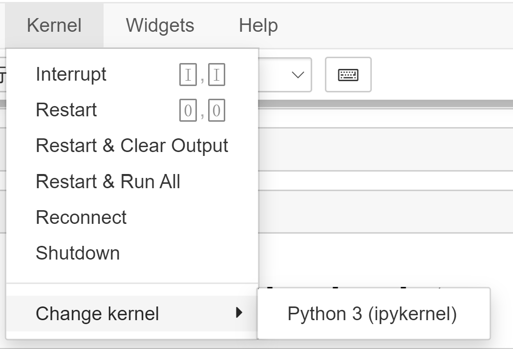

# STAR_Lab pedestrian detection model development
This project uses [tensorflow](https://www.tensorflow.org/api_docs "tensorflow API documentation") [object detecton](https://github.com/tensorflow/models/tree/master/research/object_detection "tensorflow object detection API github") API to perform pedestrian detection on a live surveillance camera feed on Raspberry Pi 4(final device TBD). By taking images(images are collected via online resourses and will be later replaced by) extracted from footages recorded by the STARLAB integrated sensor in various weather conditions and times, we trained a custom model to detection pedestrians as they cross the road or wait on the sidewalk. 

The system will then
- Count the total number of pedestrians crossing or waiting, 
- Track people as they cross,
- Predict the time required for pedestrains to make the cross,
- Communicate to the traffic light system for a safer change.
- More features TBD

The objective of this project is to enhance both safety and accessibility for non-motorized road users 
(henceforth referred to as active users) at signalized intersections in urban areas, primarily Seattle at 
first, but with plans to extend throughout the region later. In essence, an approach to facilitate user 
movements at signalized intersections using video/sensing technology inputs will be developed in order 
to (1) detect active users waiting to cross a roadway and actuate the signal for them and (2) detect any 
active users crossing the roadway, alerting drivers of active users’ presence via an alert in a mobile 
application (app), and potentially extending the crossing phase for them as needed/possible. For this 
project, the team will make use of sensing technology developed in the PI’s lab, notably the Mobile Unit 
for Sensing Traffic (MUST sensor), as well as previous app development experience. The work in this 
project directly addresses the themes of “Accessibility for All” and “Safety,” as it can make crossings 
easier for groups who may have difficulty finding/actuating a crossing signal (i.e., pedestrians with 
disabilities) and enhance safety by alerting drivers of pedestrians in the roadway who may pose a 
conflict. Finally, by enhancing the efficiency of roadway crossings and providing a means to minimize 
severe vehicle-pedestrian collisions, which can lead to tremendous delay (besides obvious physical 
harm), this project also directly addresses the center’s strategic goal of mobility.

---

The following will go through the steps to perform pedestrian detection on your machine

## software and environment setup

1. Install [anaconda](https://www.anaconda.com/products/individual#Downloads "anaconda download link") and [jupyter notebook](https://jupyter.org/install "jupyter notebook download link").
1. Clone this [repository](https://github.com/prism5426/STARLAB "repo link") repository.
1. After repository is cloned, go to the directory using **cmd prompt** in Windows and **Terminal** in Linux or MacOS.
1. Create a new conda virtual enviroment (Using python enviroment might cause access issue, but should also work)

    ```conda create -n myenv python=3.8```
1. Activate environment

    ```conda activete myenv```
1. Upgrade pip

    ```python -m pip install --upgrade pip```
1. Add virtual environment to kernel

    ```pip install ipykernel```

    ```python -m ipykernel install --user --name=myenv```
1. In the virtual environment and the repository directory, open up **jupyter notebook** and make sure the virtual environment is added to kernel.  Here you should select the kernel added to jupyter notebook. (Env not shown)

1. Run section 0 to setup model name, path, file etc. 

1. In section 1, go through the commands and make sure that you passed the VERIFICACTION_SCRIPT. If it says [OK] at the end in means you are all set. Notice that if you have an Nvidia GPU you can install the corresponding [tensorflow-gpu](https://www.tensorflow.org/install/gpu "tfgpu-link") and [cudnn](https://developer.nvidia.com/rdp/cudnn-archive "cudnn-link") version. Make sure to add envrionmental vairables. If the script outputs ```Could not load dynamic library 'cudart64_110.dll'; dlerror: cudart64_110.dll not found``` This means either you do not have an Nvidia GPU or **cudnn** and **tensorflow-gpu** is not correctly installed.

1. Now run section 8 to load a trained model, **ckpt** number is based on the model.

1. To detect from an image run section 9. Change IMAGE_PATH for other inputs if desired

1. To detect from a video or webcam, run section 10. Change **VIDEO_PATH** to *your file* or *0* if you have a webcam(number may vary if multiple webcams are connected) 

1. TODO: add instructions on how to use model on Pi
---
# Error Guide
## Windows
- ```"conda is not recognized as internal or external command"``` This means "conda" is not added to the envrionmental variables path.
    1. Open **anaconda prompt** and check where ***Conda*** is installed 

        ```where conda```
    1. In ***View Advanced system settings***, click on ***Environmental Variables***, then **Edit Path**
    1. Add the following new paths

        ```
        C:\Users\*your_username*\Anaconda3\Scripts

        C:\Users\*your_username*\Anaconda3

        C:\Users\*your_username*\Anaconda3\Library\bin
        ```
    1. Open **command prompt** and check ***Conda*** version 

        ```conda --version```

- ```"ImportError: DLL load failed while importing win32api: The specified procedure could not be found."``` This error might occur when first setup jupyter. win32 api might not be installed in the correct channel in Conda, use ```conda install -c conda-forge pywin32``` to install win32 api into the right place.

- ```"[ACCESS DENIED] error code #"``` Jupyter cannot access the required file, use ```os.chmod(PATH_TO_FILE, 0o777)``` to make it readable.

- ERROR---